# 🧩 Project_NeighFund  
> "펀딩과 소모임으로 실현하는 지역 공동체 플랫폼"

---

## ✨ 프로젝트 소개
- 지역 문제 해결을 **우리 모두의 일**로  
- **소상공인에게는 새로운 수요의 기회**,  
- **주민에게는 참여와 관계 회복의 시작점**으로  
- 지역 주민이 제안하고, 이웃과 함께 공감과 펀딩을 통해 지역 문제를 해결하는 **사회서비스형 커뮤니티 플랫폼**입니다.

---

## 🛠 사용 기술 (Tech Stack)

### 🔹 Frontend
- React  
- React Router DOM  
- Context API
- CSS Module / Styled Components  

### 🔹 Backend
- Spring Boot 3.4  
- Spring Security  
- JPA (Hibernate)  
- MySQL  
- JWT (JJWT)  
- WebSocket + STOMP
- Multipart File, Validation 등 

### 🔹 Deploy / 협업
- AWS EC2
- GitHub 
- Notion, Figma 

---

## ✅ 주요 기능 (Features)

- 💬 **제안 게시판**  
  - 제안 등록/수정/삭제
  - 카테고리 필터링, 정렬, 공감(좋아요), 페이지네이션  

- 💰 **펀딩 기능**  
  - 정책 동의 → 정보 입력 → 스토리 작성 → 리워드 작성 (4단계 흐름)  
  - 펀딩 목록 무한스크롤, 리워드 선택, 참여  

- 📊 **설문조사**  
  - 관리자 설문 등록  
  - 사용자 투표 및 실시간 결과 비율 확인

- 👤 **관리자 페이지**  
  - 제안/펀딩/설문 승인 및 상태 변경  
  - 사용자 활동 관리  

- 🌐 **실시간 알림**  
  - WebSocket 기반 참여/진행 알림

---

## 🚀 실행 방법 (Run Locally)

로컬 환경에서 NeighFund 프로젝트를 실행하기 위한 가이드입니다.

---

### 🔹 Frontend 실행 (VSCode 기준)

1. VSCode로 `frontend` 디렉토리를 엽니다.
2. 터미널을 열고 아래 명령어를 입력합니다.

```bash
cd frontend
npm install       # 패키지(의존성) 설치
npm start         # 개발 서버 실행 (기본 주소: http://localhost:3000)
```

### 🔹 Backend 실행 (IntelliJ 기준)

1. IntelliJ로 `backend` 디렉토리를 엽니다.
2. Gradle 프로젝트로 불러온 후, `build.gradle` 파일이 정상 인식되었는지 확인합니다.
3. Gradle 탭에서 `bootRun` 실행 또는 터미널에서 아래 명령어 입력:

```bash
cd backend
./gradlew bootRun       # macOS / Linux
gradlew.bat bootRun     # Windows
백엔드 서버가 실행되면 기본 주소는 http://localhost:8080 입니다.
```
⚠️ 실행 전 확인사항:

MySQL이 실행 중이어야 하며, 해당 DB 설정이 application.yml 또는 application.properties에 올바르게 입력되어 있어야 합니다.

DB 계정, 포트, 스키마 이름 등은 환경에 맞게 수정 필요

## 👥 팀원 소개 (Team Members)

| 이름     | 담당 역할 | 주요 작업 내용 |
|----------|-----------|----------------|
| **정범준** | Frontend | - 전체 레이아웃 설계<br>- 펀딩 페이지 구현<br>- 제안 게시판 UI 개발 |
| **김태형** | Frontend | - 메인 페이지 구현<br>- 마이페이지, 로그인/로그아웃 UI 구현<br>- 소모임 페이지 UI 개발 |
| **이승빈** | Backend  | - DB 설계 및 회원관리<br>- 로그인/로그아웃 (JWT, 프로필 이미지, 구글 소셜 로그인)<br>- 소모임 게시글 CRUD, 이미지 연동<br>- 실시간 알림 / 실시간 채팅 구현 |
| **안순화** | Backend  | - 제안 및 펀딩 기능 API 구현<br>- CRUD 기반 게시글 및 이미지 연동<br>- 신청자 관리 및 구매 페이지 기능 개발 |


## 📸 주요 화면 예시

### 💬 제안 게시판
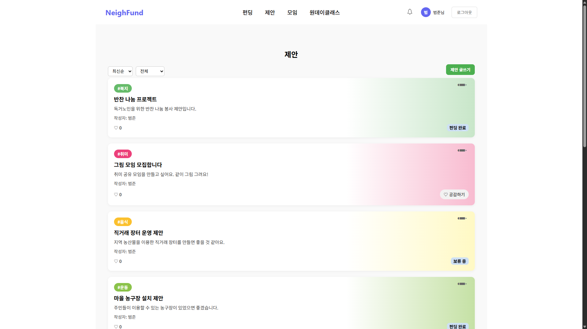
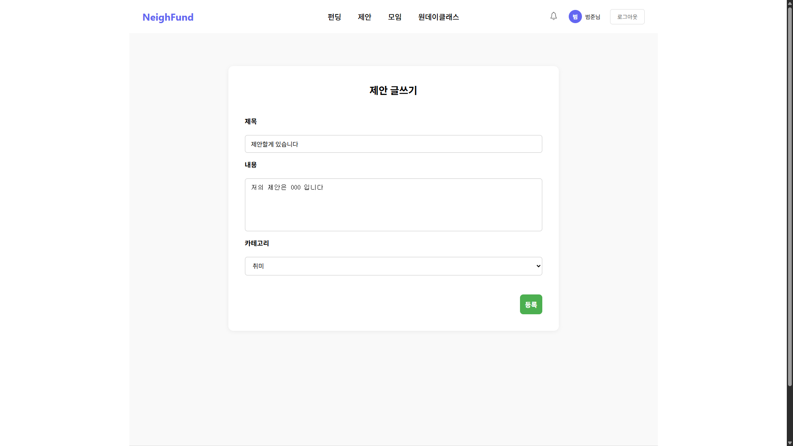
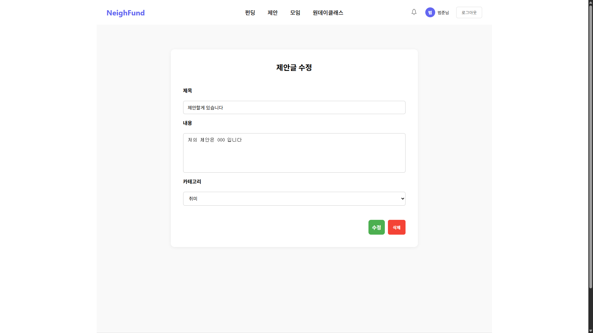
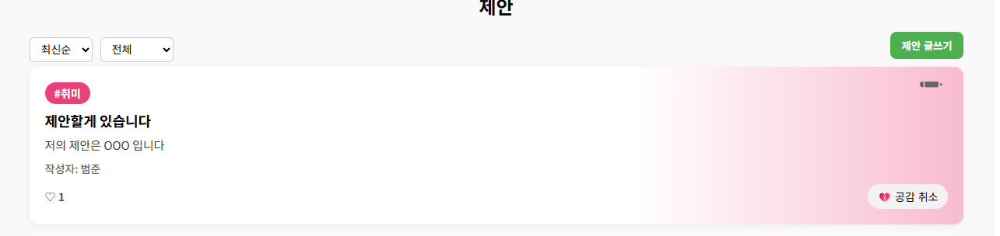

### 💰 펀딩 기능
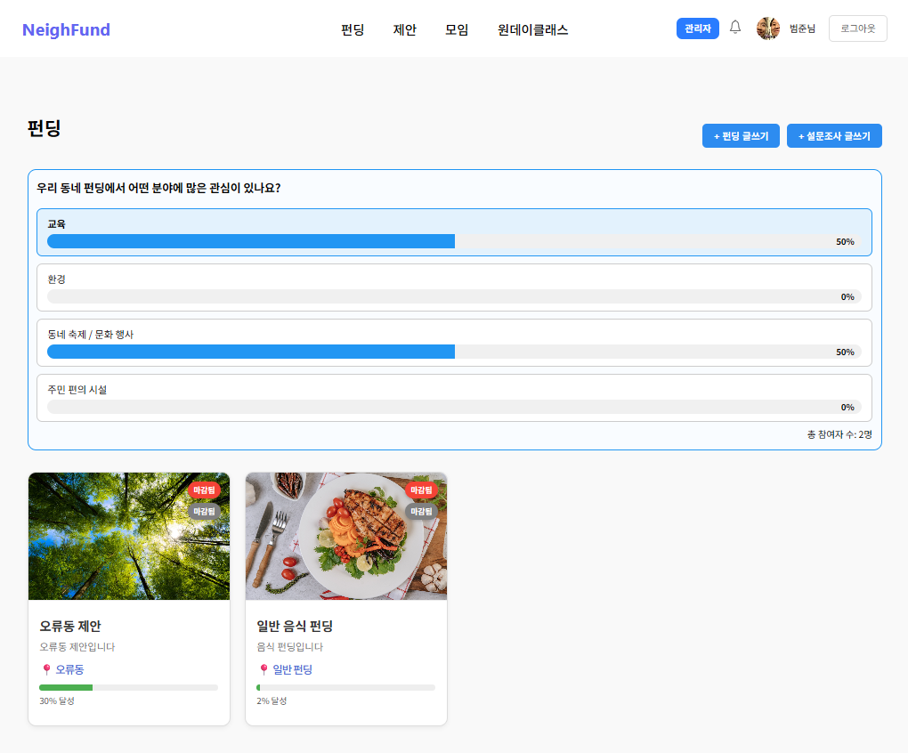
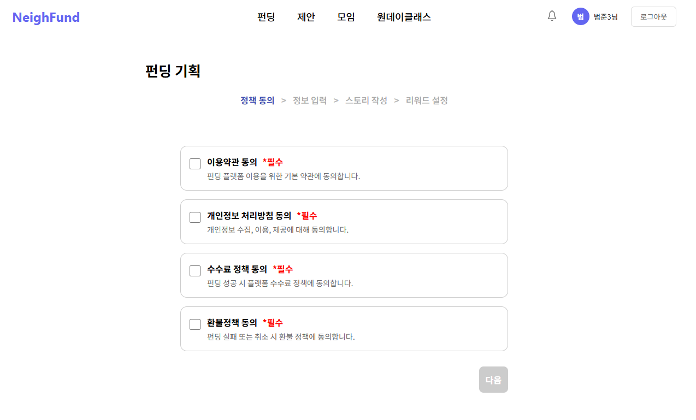
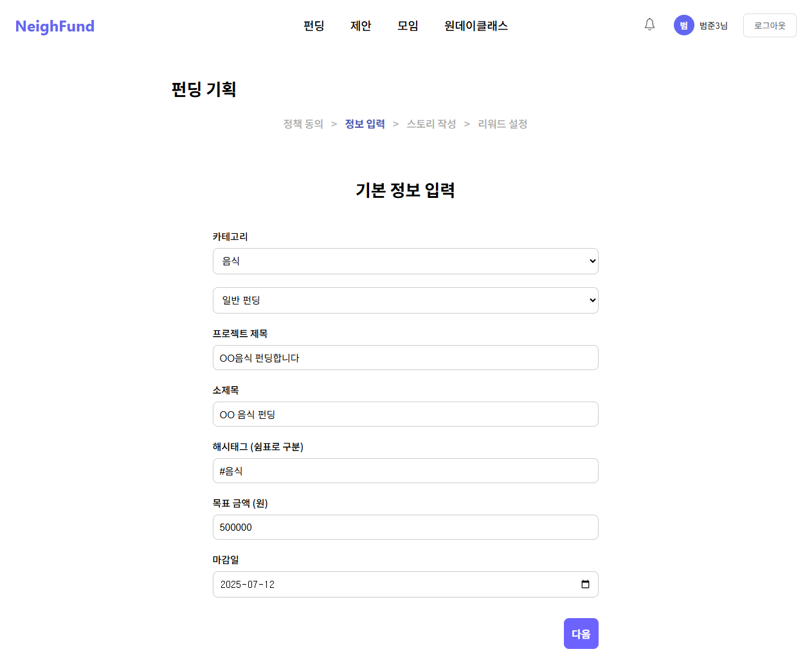
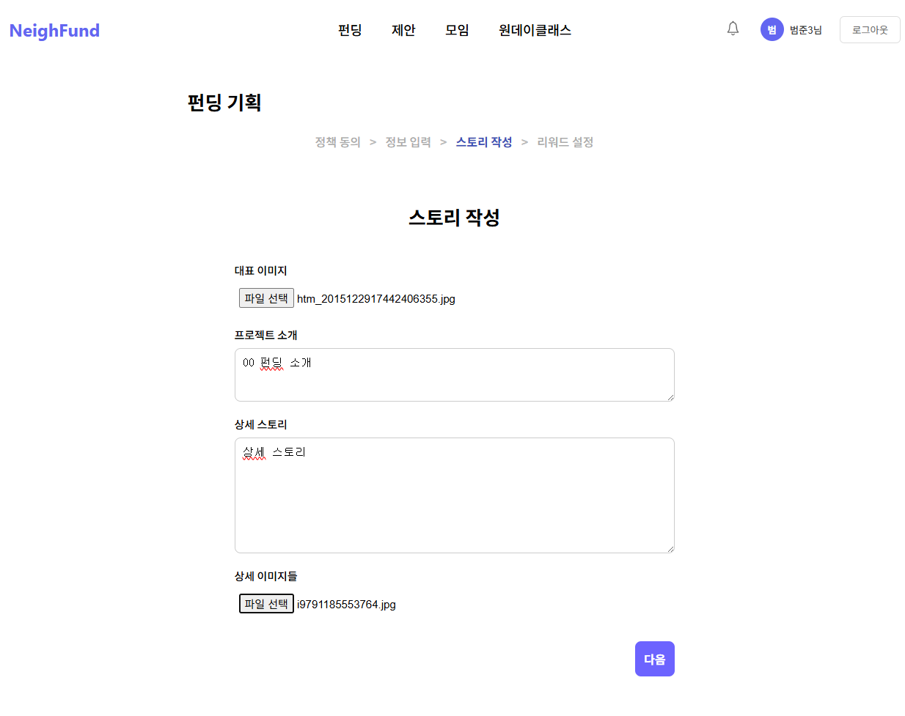
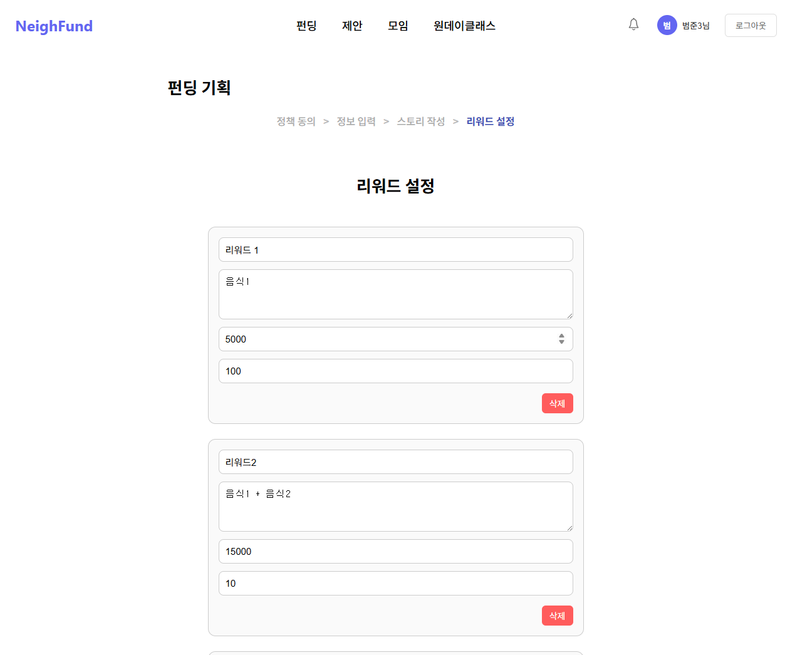
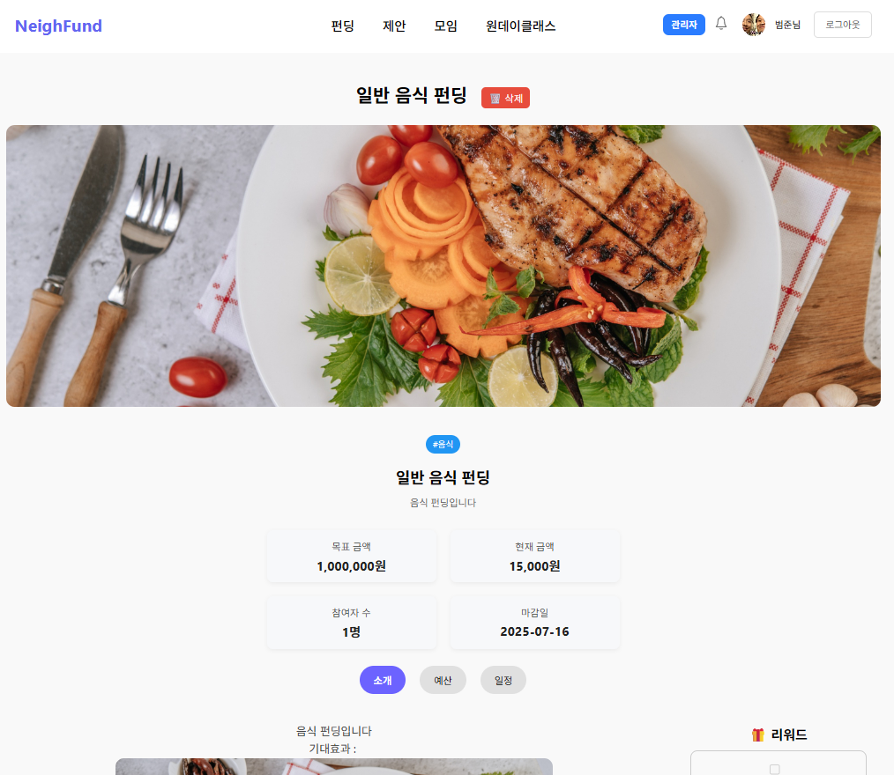
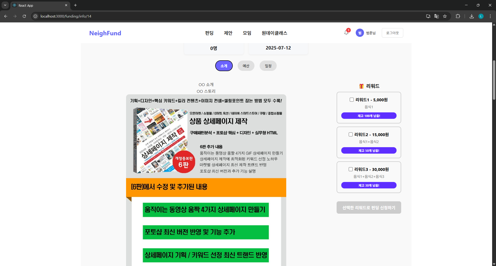

### 📊 설문조사
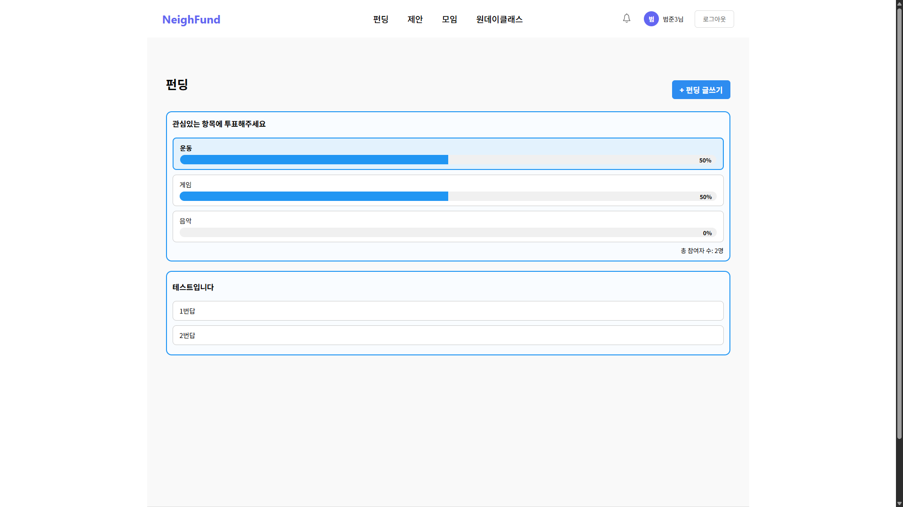

